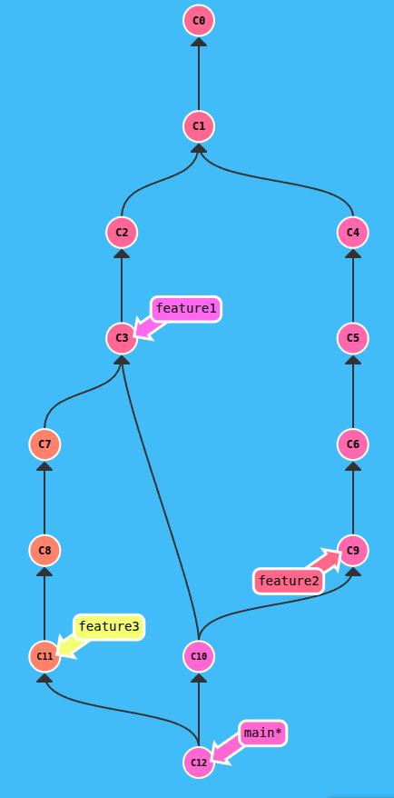
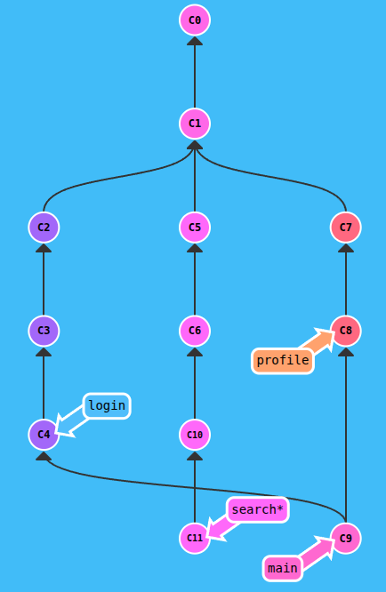
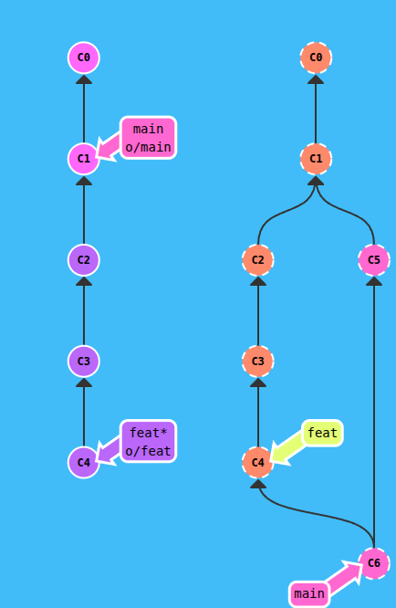

  <!-- _paginate: skip -->

  

    <h1 class="title"> Git Avanzado </h1>
    

    
Arturo Silvelo

    
Try New Roads

  

---

# Flujos de trabajo en Git

---

## Trunk Based Development

    

        
    

  

    <a href="https://learngitbranching.js.org/?NODEMO=&command=git%20branch%20feature1%3Bgit%20checkout%20feature1%3Bgit%20commit%3Bgit%20commit%3Bgit%20checkout%20main%3Bgit%20branch%20feature2%3Bgit%20checkout%20feature2%3Bgit%20commit%3Bgit%20commit%3Bgit%20commit%3Bgit%20checkout%20main%3Bgit%20merge%20feature1%3Bgit%20branch%20feature3%3Bgit%20checkout%20feature3%3Bgit%20commit%3Bgit%20commit%3Bgit%20checkout%20feature2%3Bgit%20commit%3Bgit%20checkout%20main%3Bgit%20merge%20feature2%3Bgit%20checkout%20feature3%3Bgit%20merge%20feature3%3Bgit%20commit%3Bgit%20checkout%20main%3Bgit%20merge%20feature3&locale=es_ES">Ver diagrama en LearnGitBranching</a>
      
    
 En este diagrama se observa cómo varios desarrolladores crean ramas de características (<code>feature1</code>, <code>feature2</code>, <code>feature3</code>) desde la rama principal (<code>main</code>).         Cada rama contiene varios commits y se desarrollan en paralelo. Cuando las funcionalidades están listas, se fusionan rápidamente a <code>main</code>, manteniendo el código siempre actualizado y listo para producción.
    
  

---

## Feature Branch Workflow

    

        
    

    

        <a href="https://learngitbranching.js.org/?NODEMO=&command=git%20commit%3Bgit%20commit%3Bgit%20branch%20feature%2Flogin%3Bgit%20checkout%20feature%2Flogin%3Bgit%20commit%3Bgit%20commit%3Bgit%20checkout%20main%3Bgit%20merge%20feature%2Flogin&locale=es_ES">Ver diagrama en LearnGitBranching</a>
          
        

        En este diagrama se muestra cómo cada nueva funcionalidad se desarrolla en una rama independiente (<code>login</code>) creada desde la rama principal (<code>main</code>).  
        Los desarrolladores realizan varios commits en la rama de la funcionalidad.  
        Cuando la funcionalidad está lista, se fusiona a <code>main</code> mediante un merge (normalmente a través de un Pull Request), permitiendo revisiones y control de calidad antes de integrar los cambios.
        

    

---

## Forking Workflow

    

        
    

    

        <a href="https://learngitbranching.js.org/?NODEMO=&command=git%20clone%3Bgit%20switch%20-c%20feat%3Bgit%20commit%3Bgit%20commit%3Bgit%20commit%3Bgit%20push%3Bgit%20fakeTeamwork%3Bgit%20mergeMR%20feat%20main&locale==es_ES">Ver diagrama en LearnGitBranching</a>
          
        

        En este diagrama se observa cómo un colaborador realiza un <strong>fork</strong> (copia) del repositorio principal.  
        El desarrollo se realiza en el fork, normalmente en una rama de característica (<code>feat</code>).  
        Cuando los cambios están listos, se propone una integración al repositorio original mediante un Pull Request, permitiendo revisiones y control antes de fusionar los cambios.
        

    

---
