  <!-- _paginate: skip -->

  

    <h1 class="title"> Branches y Workflows </h1>
    

    
Arturo Silvelo

    
Try New Roads

  

---

# Workflows

---

## Workflows

Un **workflow** en Git define cómo un equipo organiza, desarrolla, integra y despliega el código utilizando ramas y reglas de colaboración.

Elegir el workflow adecuado es clave para:

- Mejorar la colaboración y la calidad del código.
- Adaptarse al tamaño del equipo y la frecuencia de releases.
- Facilitar la integración continua y el despliegue automatizado.

---

## Git Flow

Git Flow es un workflow avanzado y estructurado para equipos de desarrollo que necesitan gestionar múltiples versiones, releases y hotfixes de manera ordenada.  
Se basa en el uso de varias ramas con roles bien definidos, permitiendo el desarrollo paralelo, la integración controlada y la preparación de versiones de producción.

---

### Ramas principales

- **main:** Rama principal, contiene el código listo para producción.
- **develop:** Rama de integración, donde se fusionan las nuevas funcionalidades antes de pasar a producción.

---

### Ramas secundarias

- **feature/\***: Para nuevas funcionalidades, parten de `develop` y se fusionan de vuelta a `develop`.
- **release/\***: Para preparar una nueva versión, parten de `develop` y se fusionan a `main` y `develop`.
- **hotfix/\***: Para corregir errores críticos en producción, parten de `main` y se fusionan a `main` y `develop`.

---

### Flujo de trabajo

1. **Desarrollo de nuevas funcionalidades**

   - Se crea una rama `feature/nueva-funcionalidad` desde `develop`.
   - El trabajo se realiza en la rama feature.
   - Al finalizar, se fusiona la feature en `develop`

---

2. **Preparación de una release**

   - Cuando `develop` está listo para una nueva versión, se crea una rama `release/x.y` desde `develop`.
   - Se realizan pruebas y correcciones menores en la rama release.
   - Al finalizar, se fusiona la release en `main` (y se etiqueta la versión) y en `develop`.

---

3. **Hotfixes en producción**
   - Si surge un error crítico en producción, se crea una rama `hotfix/x.y.z` desde `main`.
   - Se corrige el error en la rama hotfix.
   - Al finalizar, se fusiona el hotfix en `main` (y se etiqueta la versión) y en `develop`.

---

### Diagrama

<figure>
  
</figure>

---

## Github Flow

GitHub Flow es un workflow simple y ágil, ideal para equipos que practican integración y despliegue continuo.  
Se centra en el uso de ramas cortas y Pull Requests para facilitar la colaboración, revisión de código y despliegue frecuente a producción.

---

### Ramas principales

- **main:** Rama principal, siempre lista para producción y despliegue.

### Ramas Secundarias

- **feature/\***: Ramas de funcionalidades o fixes, creadas a partir de `main` y fusionadas de vuelta a `main`.

---

### Flujo de trabajo

1. **Crear una rama de feature**

   - Se crea una rama `feature/nueva-funcionalidad` desde `main`.

2. **Desarrollar y probar**

   - El trabajo se realiza en la rama feature.
   - Se recomienda hacer commits pequeños y frecuentes.

---

3. **Abrir un Pull Request**

   - Cuando la funcionalidad está lista, se abre un Pull Request (PR) hacia `main`.
   - Se realiza revisión de código y pruebas automáticas.

4. **Merge a main**

   - Tras la aprobación y pasar los checks, se fusiona la rama feature en `main`.
   - Opcionalmente, se despliega automáticamente a producción.

---

5. **Eliminar la rama feature**
   - Una vez fusionada, se elimina la rama feature para mantener el repositorio limpio.

---

### Diagrama

<figure>
  
</figure>

---

## Trunk Based Development

Trunk Based Development es un workflow que promueve la integración continua y la colaboración ágil.  
Todo el equipo trabaja sobre una única rama principal (llamada `main` o `trunk`), utilizando ramas de vida muy corta para tareas específicas.  
El objetivo es minimizar los conflictos y acelerar la entrega de valor, integrando cambios frecuentemente.

---

### Ramas principales

- **main/trunk:** Única rama principal, siempre lista para producción.

### Ramas secundarias

- **Ramas de tarea (opcional):** Ramas muy cortas (horas o menos), creadas para cambios específicos y eliminadas tras fusionarse.

---

### Flujo de trabajo

1. **Desarrollo directo o en ramas cortas**

   - Los desarrolladores trabajan directamente en `main` o crean ramas de tarea muy breves desde `main`.

2. **Integración frecuente**
   - Los cambios se integran a `main` varias veces al día, evitando acumulación de diferencias.

---

3. **Eliminación de ramas**

   - Las ramas de tarea se eliminan inmediatamente tras el merge para mantener el historial limpio.

4. **Despliegue continuo**
   - `main` está siempre lista para desplegar, favoreciendo la entrega continua y la automatización.

---

### Diagrama

<figure>
  
</figure>

---

## Git Feature Branch

Es un workflow sencillo y muy utilizado donde cada nueva funcionalidad o corrección se desarrolla en una rama independiente (feature branch).  
Estas ramas parten de una rama de integración (`develop`) y se fusionan de vuelta a `develop` tras revisión y pruebas, permitiendo trabajo paralelo y control de calidad antes de pasar a producción.

---

## Ramas principales

- **main:** Rama principal, siempre lista para producción.
- **develop:** Rama de integración, donde se fusionan todas las nuevas funcionalidades antes de pasar a producción.

### Ramas secundarias

- **feature/\***: Ramas para nuevas funcionalidades o fixes, parten de `develop` y se fusionan de vuelta a `develop`.

---

### Flujo de trabajo

1. **Crear una rama de feature**

   - Se crea una rama `feature/nueva-funcionalidad` desde `develop`.

2. **Desarrollar y probar**

   - El trabajo se realiza en la rama feature.
   - Se pueden abrir varias features en paralelo.

---

3. **Fusionar la feature en develop**

   - Al finalizar, se fusiona la feature en `develop` (directamente o mediante Pull Request según la política del equipo).

4. **Preparar el paso a producción**
   - Cuando `develop` está listo y probado, se fusiona en `main` para desplegar a producción.

---

### Diagrama

<figure>
  
</figure>

---

## Forking Workflow

El Forking Workflow es el modelo más habitual en proyectos open source y colaboraciones externas.  
Cada colaborador trabaja en una copia (fork) personal del repositorio principal, lo que permite contribuir sin acceso directo al repositorio original.  
Las contribuciones se integran mediante Pull Requests revisados por los mantenedores del proyecto.

---

### Ramas principales

- **upstream/main:** Rama principal del repositorio original (proyecto principal).
- **fork/main:** Rama principal del fork personal del colaborador.

### Ramas secundarias

- **fork/feature/\***: Ramas de trabajo en el fork, creadas para nuevas funcionalidades o correcciones.

---

### Flujo de trabajo

1. **Crear un fork**

   - El colaborador crea un fork del repositorio principal en su propia cuenta.

2. **Clonar el fork y crear una rama de trabajo**

   - Se clona el fork y se crea una rama `feature/nueva-funcionalidad` en el fork.

3. **Desarrollar y probar**

   - El trabajo se realiza en la rama feature del fork.

---

4. **Sincronizar con el upstream**

   - Se actualiza el fork con los últimos cambios del repositorio principal (`upstream`).

5. **Abrir un Pull Request**

   - Cuando la funcionalidad está lista, se abre un Pull Request desde el fork hacia el repositorio principal.

6. **Revisión y merge**
   - Los mantenedores revisan el PR y, si es aceptado, lo fusionan en el repositorio principal.

---

### Diagrama

<figure>
  
</figure>

---

# Naming conventions

---

## Naming conventions

Las **naming conventions** son reglas y patrones para nombrar ramas, commits y otros elementos en Git.  
Su objetivo es facilitar la organización, la colaboración y la comprensión del historial del proyecto.

---

### Ventajas

- Facilita la identificación rápida del propósito de cada rama.
- Mejora la colaboración y la revisión de código.
- Permite automatizar flujos de trabajo y políticas en plataformas como GitHub.

---

### Restricción de nombre

- **Minúsculas y guiones:** Usa solo minúsculas y separa las palabras con guiones.

- **Caracteres alfanuméricos:** Utiliza solo letras (a-z), números (0-9) y guiones. Evita espacios, guiones bajos, tildes o caracteres especiales.

- **Sin guiones continuos:** No uses guiones dobles o múltiples seguidos.

- **Sin guiones al final:** No termines el nombre de la rama con un guion.

- **Descriptivo y conciso:** El nombre debe describir claramente el propósito de la rama, de forma breve y entendible.

---

### Prefijos Ramas

Usar prefijos en los nombres de las ramas ayuda a identificar rápidamente su propósito.

- **Feature Branches:** Para desarrollar nuevas funcionalidades.
  `feature/`

- **Bugfix Branches:** Para corregir errores en el código. `bugfix/`

---

- **Hotfix Branches:** Para solucionar bugs críticos directamente en producción. `hotfix/`

- **Release Branches:** Para preparar una nueva versión de producción. `release/`

- **Documentation Branches:** Para escribir o actualizar documentación. `docs/`

---

### Incluir tickets o issues en el nombre de las ramas

Una buena práctica es incluir el identificador del ticket o issue relacionado en el nombre de la rama.  
Esto facilita la trazabilidad entre el código y las tareas del sistema de gestión de incidencias (Jira, GitHub Issues, etc.).

**Ejemplos:**

- `feature/123-login-system`
- `feature/issue-123-login-system`

---
