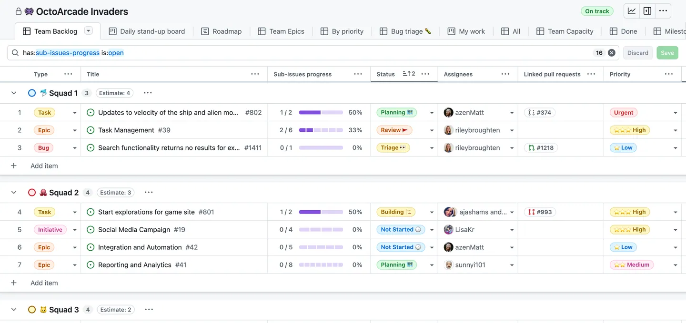
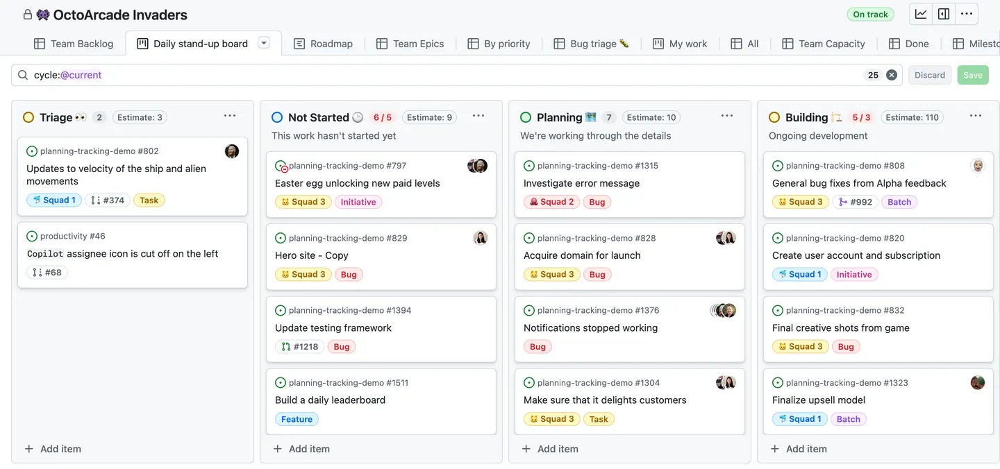
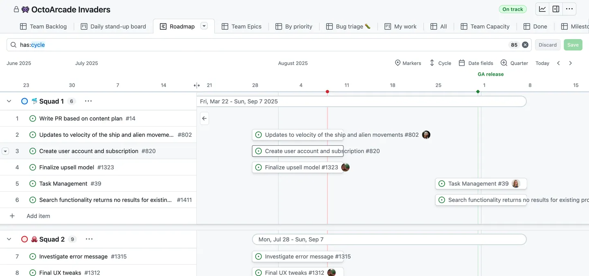

  <!-- _paginate: skip -->

  

    <h1 class="title"> Branches y Workflows </h1>
    

    
Arturo Silvelo

    
Try New Roads

  

---

# Workflows

---

## Workflows

Un **workflow** en Git define cómo un equipo organiza, desarrolla, integra y despliega el código utilizando ramas y reglas de colaboración.

Elegir el workflow adecuado es clave para:

- Mejorar la colaboración y la calidad del código.
- Adaptarse al tamaño del equipo y la frecuencia de releases.
- Facilitar la integración continua y el despliegue automatizado.

---

## Git Flow

Git Flow es un workflow avanzado y estructurado para equipos de desarrollo que necesitan gestionar múltiples versiones, releases y hotfixes de manera ordenada.  
Se basa en el uso de varias ramas con roles bien definidos, permitiendo el desarrollo paralelo, la integración controlada y la preparación de versiones de producción.

---

### Ramas principales

- **main:** Rama principal, contiene el código listo para producción.
- **develop:** Rama de integración, donde se fusionan las nuevas funcionalidades antes de pasar a producción.

---

### Ramas secundarias

- **feature/\***: Para nuevas funcionalidades, parten de `develop` y se fusionan de vuelta a `develop`.
- **release/\***: Para preparar una nueva versión, parten de `develop` y se fusionan a `main` y `develop`.
- **hotfix/\***: Para corregir errores críticos en producción, parten de `main` y se fusionan a `main` y `develop`.

---

### Flujo de trabajo

1. **Desarrollo de nuevas funcionalidades**

   - Se crea una rama `feature/nueva-funcionalidad` desde `develop`.
   - El trabajo se realiza en la rama feature.
   - Al finalizar, se fusiona la feature en `develop`

---

2. **Preparación de una release**

   - Cuando `develop` está listo para una nueva versión, se crea una rama `release/x.y` desde `develop`.
   - Se realizan pruebas y correcciones menores en la rama release.
   - Al finalizar, se fusiona la release en `main` (y se etiqueta la versión) y en `develop`.

---

3. **Hotfixes en producción**
   - Si surge un error crítico en producción, se crea una rama `hotfix/x.y.z` desde `main`.
   - Se corrige el error en la rama hotfix.
   - Al finalizar, se fusiona el hotfix en `main` (y se etiqueta la versión) y en `develop`.

---

### Diagrama

<figure>
  
</figure>

---

## Github Flow

GitHub Flow es un workflow simple y ágil, ideal para equipos que practican integración y despliegue continuo.  
Se centra en el uso de ramas cortas y Pull Requests para facilitar la colaboración, revisión de código y despliegue frecuente a producción.

---

### Ramas principales

- **main:** Rama principal, siempre lista para producción y despliegue.

### Ramas Secundarias

- **feature/\***: Ramas de funcionalidades o fixes, creadas a partir de `main` y fusionadas de vuelta a `main`.

---

### Flujo de trabajo

1. **Crear una rama de feature**

   - Se crea una rama `feature/nueva-funcionalidad` desde `main`.

2. **Desarrollar y probar**

   - El trabajo se realiza en la rama feature.
   - Se recomienda hacer commits pequeños y frecuentes.

---

3. **Abrir un Pull Request**

   - Cuando la funcionalidad está lista, se abre un Pull Request (PR) hacia `main`.
   - Se realiza revisión de código y pruebas automáticas.

4. **Merge a main**

   - Tras la aprobación y pasar los checks, se fusiona la rama feature en `main`.
   - Opcionalmente, se despliega automáticamente a producción.

---

5. **Eliminar la rama feature**
   - Una vez fusionada, se elimina la rama feature para mantener el repositorio limpio.

---

### Diagrama

<figure>
  
</figure>

---

## Trunk Based Development

Trunk Based Development es un workflow que promueve la integración continua y la colaboración ágil.  
Todo el equipo trabaja sobre una única rama principal (llamada `main` o `trunk`), utilizando ramas de vida muy corta para tareas específicas.  
El objetivo es minimizar los conflictos y acelerar la entrega de valor, integrando cambios frecuentemente.

---

### Ramas principales

- **main/trunk:** Única rama principal, siempre lista para producción.

### Ramas secundarias

- **Ramas de tarea (opcional):** Ramas muy cortas (horas o menos), creadas para cambios específicos y eliminadas tras fusionarse.

---

### Flujo de trabajo

1. **Desarrollo directo o en ramas cortas**

   - Los desarrolladores trabajan directamente en `main` o crean ramas de tarea muy breves desde `main`.

2. **Integración frecuente**
   - Los cambios se integran a `main` varias veces al día, evitando acumulación de diferencias.

---

3. **Eliminación de ramas**

   - Las ramas de tarea se eliminan inmediatamente tras el merge para mantener el historial limpio.

4. **Despliegue continuo**
   - `main` está siempre lista para desplegar, favoreciendo la entrega continua y la automatización.

---

### Diagrama

<figure>
  
</figure>

---

## Git Feature Branch

Es un workflow sencillo y muy utilizado donde cada nueva funcionalidad o corrección se desarrolla en una rama independiente (feature branch).  
Estas ramas parten de una rama de integración (`develop`) y se fusionan de vuelta a `develop` tras revisión y pruebas, permitiendo trabajo paralelo y control de calidad antes de pasar a producción.

---

## Ramas principales

- **main:** Rama principal, siempre lista para producción.
- **develop:** Rama de integración, donde se fusionan todas las nuevas funcionalidades antes de pasar a producción.

### Ramas secundarias

- **feature/\***: Ramas para nuevas funcionalidades o fixes, parten de `develop` y se fusionan de vuelta a `develop`.

---

### Flujo de trabajo

1. **Crear una rama de feature**

   - Se crea una rama `feature/nueva-funcionalidad` desde `develop`.

2. **Desarrollar y probar**

   - El trabajo se realiza en la rama feature.
   - Se pueden abrir varias features en paralelo.

---

3. **Fusionar la feature en develop**

   - Al finalizar, se fusiona la feature en `develop` (directamente o mediante Pull Request según la política del equipo).

4. **Preparar el paso a producción**
   - Cuando `develop` está listo y probado, se fusiona en `main` para desplegar a producción.

---

### Diagrama

<figure>
  
</figure>

---

## Forking Workflow

El Forking Workflow es el modelo más habitual en proyectos open source y colaboraciones externas.  
Cada colaborador trabaja en una copia (fork) personal del repositorio principal, lo que permite contribuir sin acceso directo al repositorio original.  
Las contribuciones se integran mediante Pull Requests revisados por los mantenedores del proyecto.

---

### Ramas principales

- **upstream/main:** Rama principal del repositorio original (proyecto principal).
- **fork/main:** Rama principal del fork personal del colaborador.

### Ramas secundarias

- **fork/feature/\***: Ramas de trabajo en el fork, creadas para nuevas funcionalidades o correcciones.

---

### Flujo de trabajo

1. **Crear un fork**

   - El colaborador crea un fork del repositorio principal en su propia cuenta.

2. **Clonar el fork y crear una rama de trabajo**

   - Se clona el fork y se crea una rama `feature/nueva-funcionalidad` en el fork.

3. **Desarrollar y probar**

   - El trabajo se realiza en la rama feature del fork.

---

4. **Sincronizar con el upstream**

   - Se actualiza el fork con los últimos cambios del repositorio principal (`upstream`).

5. **Abrir un Pull Request**

   - Cuando la funcionalidad está lista, se abre un Pull Request desde el fork hacia el repositorio principal.

6. **Revisión y merge**
   - Los mantenedores revisan el PR y, si es aceptado, lo fusionan en el repositorio principal.

---

### Diagrama

<figure>
  
</figure>

---

# Naming conventions

---

## Naming conventions

Las **naming conventions** son reglas y patrones para nombrar ramas, commits y otros elementos en Git.  
Su objetivo es facilitar la organización, la colaboración y la comprensión del historial del proyecto.

---

### Ventajas

- Facilita la identificación rápida del propósito de cada rama.
- Mejora la colaboración y la revisión de código.
- Permite automatizar flujos de trabajo y políticas en plataformas como GitHub.

---

### Restricción de nombre

- **Minúsculas y guiones:** Usa solo minúsculas y separa las palabras con guiones.

- **Caracteres alfanuméricos:** Utiliza solo letras (a-z), números (0-9) y guiones. Evita espacios, guiones bajos, tildes o caracteres especiales.

- **Sin guiones continuos:** No uses guiones dobles o múltiples seguidos.

- **Sin guiones al final:** No termines el nombre de la rama con un guion.

- **Descriptivo y conciso:** El nombre debe describir claramente el propósito de la rama, de forma breve y entendible.

---

### Prefijos Ramas

Usar prefijos en los nombres de las ramas ayuda a identificar rápidamente su propósito.

- **Feature Branches:** Para desarrollar nuevas funcionalidades.
  `feature/`

- **Bugfix Branches:** Para corregir errores en el código. `bugfix/`

---

- **Hotfix Branches:** Para solucionar bugs críticos directamente en producción. `hotfix/`

- **Release Branches:** Para preparar una nueva versión de producción. `release/`

- **Documentation Branches:** Para escribir o actualizar documentación. `docs/`

---

### Incluir tickets o issues en el nombre de las ramas

Una buena práctica es incluir el identificador del ticket o issue relacionado en el nombre de la rama.  
Esto facilita la trazabilidad entre el código y las tareas del sistema de gestión de incidencias (Jira, GitHub Issues, etc.).

**Ejemplos:**

- `feature/123-login-system`
- `feature/issue-123-login-system`

---

# Ramas protegidas

---

## Ramas protegidas

Las **ramas protegidas** es una funcionalidad que permite establecer reglas y restricciones sobre ramas críticas (como `main` o `develop`) para mejorar la seguridad y la calidad del código.

---

### ¿Qué se puede proteger?

- Requerir revisiones de Pull Request antes de hacer merge.

  En un equipo de desarrollo, antes de fusionar una nueva funcionalidad en `main`, se exige que al menos otro desarrollador revise el código y apruebe el Pull Request.

---

- Exigir que los checks de CI/CD pasen antes de permitir el merge.

  Antes de aceptar cambios en `main`, el sistema ejecuta automáticamente tests, linters y builds. Solo si todos los checks pasan, se permite el merge, evitando que código roto llegue a producción.

---

- Restringir quién puede hacer push o borrar la rama.

  Solo los líderes técnicos o el equipo de DevOps pueden hacer push directo a `main` o borrar la rama. Esto protege el código crítico y evita errores accidentales por parte de colaboradores.

---

- Bloquear force-push y borrado accidental.

  Se impide que cualquier usuario sobrescriba el historial de `main` con `git push --force` o elimine la rama por error. Así se mantiene la integridad del historial y se evitan pérdidas de trabajo.

---

- Exigir firmas en los commits.

  En proyectos donde la trazabilidad y la autoría son críticas (por ejemplo, software financiero o sanitario), se exige que todos los commits en `main` estén firmados digitalmente. Esto garantiza la autenticidad y la responsabilidad de cada cambio.

---

### Configuración

En GitHub, **Settings > Branches** y define las reglas para tus ramas principales.

- **Bypass list:**  
  Lista de usuarios o equipos que pueden omitir (bypass) ciertas reglas de protección, como hacer push directo o fusionar sin cumplir todos los checks.

- **Target branches:**  
  Especifica a qué ramas se aplican las reglas de protección (por ejemplo, `main`, `develop`, o patrones como `release/*`).

- **Rules:**  
  Conjunto de restricciones y políticas que se aplican a las ramas seleccionadas.  
  Ejemplos: requerir revisiones de PR, checks de CI/CD, firmas, etc.

---

# Pull Request

---

## Pull Request

Un **Pull Request (PR)** es una solicitud para fusionar cambios de una rama (feature, bugfix, etc.) a una rama principal (`main`, `develop`, etc.) en plataformas como GitHub.

Permite la revisión colaborativa, la integración controlada y la automatización de validaciones antes de aceptar cambios en el proyecto.

---

### Estrategias de merge en PRs

- **Merge commit:**  
  Fusiona la rama y crea un commit de merge, preservando el historial completo.

- **Squash merge:**  
  Combina todos los commits de la rama en uno solo antes de fusionar, dejando el historial más limpio.

- **Rebase and merge:**  
  Reescribe el historial de la rama para que los commits se añadan de forma lineal sobre la rama destino.

---

### Prevención y resolución de conflictos

- Actualiza la rama feature antes de abrir el PR para minimizar conflictos.
- Usa revisiones colaborativas para detectar y resolver conflictos de código.
- Aplica buenas prácticas de comunicación y documentación en los PRs.

---

# Integración con GitHub Projects

---

### ¿Qué es GitHub Projects?

Un **proyecto** es una tabla adaptable, un panel y un plan de desarrollo que se integra con las incidencias y Pull Requests en GitHub para ayudar a planear y realizar el seguimiento del trabajo de forma eficaz, tanto a nivel de usuario como de organización.

Puedes crear y personalizar varias vistas mediante el filtrado, la ordenación, la segmentación y la agrupación de incidencias y solicitudes de cambios para administrar los trabajos pendientes y planes de desarrollo de tu equipo.

---

## Tipo de vistas

---

### Tabla

El diseño de tabla es una hoja de cálculo eficaz y adaptable formada por incidencias, solicitudes de incorporación de cambios y problemas en borrador con metadatos de GitHub y los campos personalizados que ha agregado al proyecto.

<figure>
  
</figure>

---

### Panel

Distribuye las incidencias, las solicitudes de incorporación de cambios y los borradores de incidencias en columnas personalizables

<figure>
  
</figure>

---

### Roadmap

Proporciona una visualización de alto nivel del proyecto en un intervalo de tiempo configurable y permite arrastrar elementos para que afecten a sus fechas de inicio y destino o iteración seleccionada

<figure>
  
</figure>

---

## Elementos

---

- **Issues**

  Elementos que representan tareas, mejoras, bugs, preguntas o cualquier tipo de trabajo a realizar, en progreso o ya resuelto dentro del proyecto.

- **Pull Requests (PRs):**

  Solicitudes de incorporación de cambios que pueden vincularse a issues y reflejan trabajo en curso o revisado.

---

## Campos personalizados

---

- **Etiquetas (Labels):**  
  Clasifican y agrupan issues y PRs según categorías, estado, prioridad, etc.

- **Fecha Inicio/Fin:**  
  Permite registrar cuándo comienza y termina una tarea, issue o PR, facilitando la planificación y el seguimiento temporal.

- **Milestones:**  
  Agrupan issues y PRs bajo un objetivo o entrega común (por ejemplo, una release o sprint).

- **Status:**  
  Indica el estado actual del elemento (por ejemplo, “To Do”, “In Progress”, “Done”, “Blocked”).

---

- **Prioridad:**  
  Ayuda a identificar la urgencia o importancia de cada elemento (por ejemplo, “Alta”, “Media”, “Baja”).

- **Responsable (Assignee):**  
  Muestra quién está encargado de la tarea o revisión.

- **Tipo de tarea:**  
  Clasifica el elemento como bug, feature, mejora, documentación, etc.

- **Sprint/Iteración:**  
  Permite agrupar elementos por ciclos de trabajo o entregas.

---

### Workflows/Automatizaciones

Los **workflows** y **automatizaciones** permiten definir reglas y acciones automáticas que gestionan el movimiento y el estado de issues y Pull Requests dentro de un proyecto.  
Ayudan a mantener el tablero actualizado, reducir tareas manuales y mejorar la eficiencia del equipo.

---

### Ejemplos

- Cuando Pull Request se fusiona correctamente mover a `Done`
- Cuando un item es cerrado (PR, issue) mover a `Done`
- Crear ramas automáticamente asociadas a una issue.
- Asignar responsables o etiquetas según el tipo de tarea o prioridad.
