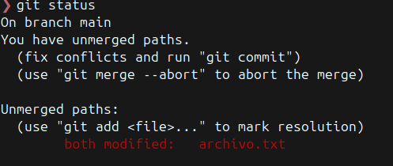
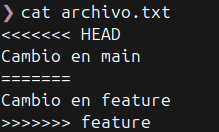
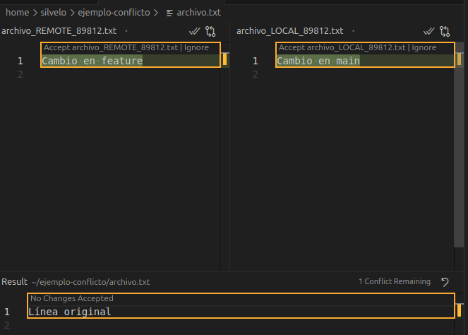

  <!-- _paginate: skip -->

  <div class="front">
    <h1 class="title"> Resolución de conflictos  </h1>
    <hr class="line"/>
    <p class="author">Arturo Silvelo</p>
    <p class="company">Try New Roads</p>
  </div>

---

## Conflictos

---

### Conflictos

Un **conflicto** ocurre cuando Git no puede fusionar automáticamente los cambios realizados en diferentes ramas o commits, porque afectan a las mismas líneas de un archivo o a archivos eliminados/modificados en paralelo.

---

### Situaciones comunes que generan conflictos

- **Edición concurrente:**  
  Dos o más personas modifican las mismas líneas de un archivo en ramas diferentes.

- **Eliminación y modificación:**  
  Un archivo se elimina en una rama y se modifica en otra.

- **Renombrado de archivos:**  
  Un archivo se renombra en una rama y se edita en otra.

---

- **Rebase o cherry-pick:**  
  Al reescribir el historial, pueden surgir conflictos si los cambios ya existen en otra rama.

- **Fusión de ramas antiguas:**  
  Cuanto más tiempo pasa sin fusionar ramas, mayor es la probabilidad de conflictos.

---

### Cómo prevenir conflictos en Git

- **Comunicación constante:**  
  Habla con tu equipo sobre los archivos en los que estás trabajando para evitar solapamientos.

- **Fusiones frecuentes:**  
  Integra los cambios de la rama principal (`main` o `develop`) en tu rama de trabajo de forma regular para minimizar diferencias.

- **Pequeños commits y ramas cortas:**  
  Trabaja en ramas de vida corta y realiza commits pequeños y frecuentes para facilitar la integración.

---

- **Evita cambios masivos:**  
  No hagas refactors grandes o cambios estructurales sin avisar al equipo.

- **Herramientas de bloqueo:**  
  Usa mecanismos de bloqueo o advertencia en archivos críticos (por ejemplo, archivos binarios o de configuración global).

---

### ¿Cómo se identifica un conflicto en Git?

- Al intentar hacer un `merge`, `rebase` o `cherry-pick`, Git detiene la operación y muestra un mensaje de conflicto.
- Los archivos afectados aparecen como “Unmerged” en `git status`.

<figure>
  
</figure>

---

- Git inserta marcas especiales en los archivos conflictivos para señalar las diferencias

<figure>
  
</figure>

- Debes editar manualmente los archivos para resolver el conflicto, eliminar las marcas y decidir qué cambios conservar.

---

### Resolución manual de conflictos

1. Abrir el archivo marcado como conflictivo.

2. Localiza las marcas de conflicto:

<figure>
  
</figure>

---

3. Decide qué cambios conservar, elimina las marcas y guarda el archivo.

   ```text
   Cambio en feature
   ```

4. Añade el archivo resuelto al stage:

   ```bash
   git add archivo.txt
   ```

5. Finaliza el merge o rebase:
   ```bash
   git commit
   # o si es parte de un merge, simplemente:
   git merge --continue
   ```

---

### Resolución automática de conflictos

En algunos casos, puedes indicar a Git que resuelva los conflictos priorizando los cambios de una rama sobre otra:

- **Priorizar la rama actual:**

  ```bash
  git merge -X ours feature
  ```

  Conserva los cambios de la rama actual en todos los conflictos.

- **Priorizar la rama que se fusiona:**
  ```bash
  git merge -X theirs feature
  ```
  Conserva los cambios de la rama que se está fusionando.

---


### Herramientas gráficas y editores online

- **Editores locales:**  
  Herramientas como VS Code permiten visualizar los conflictos, comparar versiones y seleccionar los cambios a conservar de forma intuitiva.

- **Editores online:**  
  Plataformas como GitHub y GitLab ofrecen editores web para resolver conflictos directamente en la interfaz al fusionar Pull Requests.

---

## Mergetool — resolución visual de conflictos

Un mergetool es una herramienta externa que Git puede ejecutar cuando surge un conflicto para facilitar la resolución de forma gráfica. Normalmente presenta la versión base (BASE), la versión local (LOCAL), la versión remota (REMOTE) y un panel con el resultado combinado (MERGED), de modo que puedes comparar, elegir y editar el resultado sin tocar manualmente las marcas <<<<>>>> en el archivo.

---

<figure>

</figure>

---

## Auditoría y depuración en Git

---

### git blame

Es una herramienta de auditoría que muestra, línea por línea, quién fue el autor y en qué commit se modificó cada parte de un archivo.

```
git blame <archivo>
```

---

1. Descomprimir el fichero `ejemplo-auditoria.zip`
2. Ejecuta el test para comprobar el bug

   ```bash
   python3 test.py
   2 + 3 =  -1
   2 * 3 =  6
   6 / 3 =  2.0
   ```

---

3. Consulta quién ha modificado cada línea de `calc.py`

   ```
   git blame calc.py
   ^3e94666 (Teacher Example 2025-10-21 10:38:41 +0200 1) def suma(a, b):
   76090567 (Bug Introducer  2025-10-21 10:39:33 +0200 2)     return a - b
   76090567 (Bug Introducer  2025-10-21 10:39:33 +0200 3)
   76090567 (Bug Introducer  2025-10-21 10:39:33 +0200 4) def multiplicacion(a, b):
   76090567 (Bug Introducer  2025-10-21 10:39:33 +0200 5)     return a * b
   4833ce7a (Colaborator     2025-10-21 10:41:04 +0200 6)
   4833ce7a (Colaborator     2025-10-21 10:41:04 +0200 7) def division(a, b):
   4833ce7a (Colaborator     2025-10-21 10:41:04 +0200 8)     return a / b
   ```

4. Visualiza los detalles del commit que introdujo el bug

   ```
   git show 76090567
   commit 76090567bc0a7c60f50761fadef79e3a67716e80
   Author: Bug Introducer <bug@example.com>
   Date:   Tue Oct 21 10:39:33 2025 +0200

       Commit C: bug en suma y añadir multiplicación
   ```

---

### git bisect

Herramienta de depuración que permite localizar el commit exacto donde se introdujo un bug, utilizando búsqueda binaria en el historial del repositorio.  
Es especialmente útil en proyectos con muchos cambios, ya que agiliza la búsqueda y facilita la depuración colaborativa y automatizada.

---

**¿Cómo se usa?**

1. **Inicia el proceso:**

```
git bisect start
git bisect bad HEAD
git bisect good <hash-del-commit-bueno>
```

2. **Itera entre commits:**

```
git bisect bad
git bisect good
```

3. Finaliza y vuelve al estado original:

```
git bisect reset
```

---

1. Descomprimir el proyecto `ejemplo-auditoria.zip`.
2. Ejecuta el test para comprobar el bug

   ```bash
   python3 test.py
   2 + 3 =  -1
   2 * 3 =  6
   6 / 3 =  2.0
   ```

---

3. Consulta el historial de commits para identificar el último bueno y el actual

   ```
   git log --oneline
   * cb49a8c (HEAD -> main) Commit G: mejora del test
   * 05d0a61 Commit F: test para división
   * 4833ce7 Commit E: añadir división
   * c0f3051 Commit D: test para multiplicación
   * 7609056 Commit C: bug en suma y añadir multiplicación
   * 3e3ece8 Commit B: test para suma
   * 3e94666 Commit A: suma correcta
   ```

4. Inicia el proceso de bisect

   ```
   git bisect start
   git bisect bad HEAD
   git bisect good 3e3ece8
   ```

---

5. En cada iteración, ejecuta el test y marca el commit como bueno o malo:

   ```
   python3 test.py
   git bisect good # git bisect bad
   ```

6. Cuando git bisect localice el commit problemático, finaliza el proceso y corrige el bug

   ```
   git bisect reset
   ```
