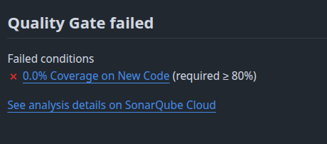

  <!-- _paginate: skip -->

  <div class="front">
    <h1 class="title"> CI/CD </h1>
    <hr class="line"/>
    <p class="author">Arturo Silvelo</p>
    <p class="company">Try New Roads</p>
  </div>

---

## Introducción a CI/CD

---

### ¿Qué es CI y CD?

- CI (Continuous Integration): automatiza la integración de cambios (build + tests) en cada push/PR para detectar errores pronto.
- CD (Continuous Delivery / Deployment): automatiza la entrega o despliegue de artefactos a entornos (staging/production).
  - Delivery: artefactos preparados para desplegar manualmente.
  - Deployment: despliegue automático a producción.

---

## Hooks

---

### Hooks

Son pequeños scripts que Git ejecuta automáticamente en determinados eventos. Sirven para automatizar comprobaciones y tareas locales (formateo, lint, tests rápidos) y, en servidores, para aplicar políticas obligatorias que no se pueden omitir desde el cliente.

---

### Hooks del lado cliente (comunes)

- **pre-commit** - antes del commit

  - Linters
    <div class=small>

        ```bash
          set -e

          # Obtener archivos staged que terminan en .py
          FILES=$(git diff --cached --name-only --diff-filter=ACM | grep '\.py$')

          if [ -z "$FILES" ]; then
            echo "No Python files to lint."
            exit 0
          fi

          # Ejecutar Flake8 en los archivos staged
          echo "Running Flake8..."
          echo "$FILES" | xargs flake8

          if [ $? -ne 0 ]; then
            echo "Flake8 found issues. Commit aborted."
            exit 1
          fi

          echo "Flake8 passed. Proceeding with commit."
          exit 0
        ```
    </div>


---

- **pre-push** - ejecutar checks antes de permitir un push

  - Tests, build rápidos, validar nombres de ramas.


  ```bash
    set -euo pipefail

    BRANCH=$(git rev-parse --abbrev-ref HEAD 2>/dev/null || echo "")

    PATTERN='^(feature|fix|hotfix|release)\/[a-z0-9._-]+(-[a-z0-9._-]+)*$|^(main|develop)$'

    if [ -z "$BRANCH" ]; then
      echo "ERROR: No se pudo determinar la rama actual. Abortando push." >&2
      exit 1
    fi

    if ! echo "$BRANCH" | grep -Eq "$PATTERN"; then
      echo "ERROR: Nombre de rama inválido: '$BRANCH'" >&2
      echo "El nombre de la rama debe seguir el formato: <tipo>/<descripcion> o ser 'main' o 'develop'." >&2
      exit 1
    fi

  ```

---

- **commit-msg** - validar el formato del mensaje

  - Commitlint / Conventional Commits


- **post-merge / post-checkout** - acciones tras actualizar la rama
  - Instalar dependencias / regenerar artefactos

---

### Hooks del lado servidor

- **pre-receive** - antes de actualizar cualquier ref del repositorio

  - Validaciones globales y rechazar push (políticas, secrets)

- **update** - una vez por cada ref que se está actualizando

  - Validaciones específicas por rama

- **post-receive** - después de que todas las refs hayan sido actualizadas
  - Triggers: despliegues, notificaciones, CI jobs

---

### Configuración

Los hooks nativos de Git se guardan en la carpeta `.git/hooks` de cada repositorio local. Por defecto, los hooks solo afectan al repositorio local y **no se versionan ni comparten**.

---

#### Cambiar el path

Git permite cambiar el directorio de hooks con el parámetro de configuración. Esto permite versionar los hooks en una carpeta del proyecto (por ejemplo, ./hooks/)

```bash
git config core.hooksPath <ruta/nueva>
```

---

#### Herramientas

El uso de herramientas específicas para gestionar hooks es clave para evitar problemas de compatibilidad entre sistemas operativos y garantizar un flujo de trabajo uniforme:

- **Automatización**: Permiten ejecutar validaciones de código, formateo o chequeos de calidad de forma automática, independientemente del sistema operativo.

- **Consistencia**: Aseguran que todos los desarrolladores sigan las mismas reglas y estándares, sin importar si trabajan en Windows, Linux o macOS.

---

- **Compatibilidad multiplataforma**: Resuelven diferencias en entornos de ejecución (como rutas, permisos o shells) al proporcionar una capa de abstracción que funciona de manera uniforme en cualquier sistema operativo.

- **Integración con CI/CD**: Facilitan la conexión con pipelines automatizados, asegurando que las mismas reglas locales se apliquen en los entornos de integración y despliegue.

---

## Librerías Hooks

- **[Husky](https://typicode.github.io/husky/)**: Permite versionar, instalar y gestionar hooks fácilmente en proyectos modernos.

> [Script husky](https://github.com/typicode/husky/blob/main/index.js#L14)


- **[Pre-commit](https://pre-commit.com/)**: es una herramienta multiplataforma para gestionar y versionar hooks de Git


---

## Conventional Commits

---

### Conventional Commits

Conventional Commits es una convención simple para mensajes de commit que aporta estructura al historial: facilita changelogs automáticos, versionado semántico y automatizaciones en CI/CD.

---

### Formato general

```
<type>(<scope>): <subject>
<BLANK LINE>
<body>
<BLANK LINE>
<footer>
```

---

### Type

- feat — nueva funcionalidad
- fix — corrección de bug
- docs — documentación
- style — formato (sin cambios de lógica)
- refactor — refactorización (sin cambios funcionales)
- perf — mejoras de rendimiento
- test — tests añadidos/modificados
- chore — tareas de mantenimiento
- ci — cambios en CI/CD

---

## Scope, subject y reglas básicas

- scope: opcional, indica área afectada (kebab-case): `feat(api)`, `fix(ui-button)`
- subject: breve, en minúsculas, modo imperativo, sin punto final: `fix(login): validate token`
- body: explica el “por qué” si hace falta
- footer: notas de breaking change o referencias a issues, ej. `BREAKING CHANGE: cambia X` o `Closes #123`

---

## Breaking changes

Se documentan en el footer:

```
feat(api): change response format

BREAKING CHANGE: response now includes 'meta' field instead of top-level 'count'
Closes #456
```

Los breaking changes suelen disparar incremento mayor en versionado semántico (major).

---

#### Herramientas

- **[Commitlint](https://commitlint.js.org/guides/local-setup.html)**: Valida automáticamente que los mensajes de commit sigan una convención

- **[Commitizen](https://commitizen-tools.github.io/commitizen/tutorials/auto_check/)**: Es una herramienta que guía al usuario para escribir mensajes de commit estructurados y válidos, siguiendo convenciones como Conventional Commits.


---

## Github Actions

---

### Github Actions

Es la plataforma de automatización de GitHub para crear workflows de CI/CD directamente en el repositorio.  
Permite definir procesos automáticos (build, test, lint, deploy, análisis, etc.) usando archivos YAML:


- **GitHub Actions**: workflows en `.github/workflows/*.yml` dentro del repo.
- **GitLab CI**: configuración en la raíz del repo en .`gitlab-ci.yml`.
---

### Conceptos clave

- **Workflow:** Archivo YAML que define el proceso automatizado.
- **Job:** Conjunto de pasos que se ejecutan en un runner.
- **Step:** Acción individual dentro de un job (ejecutar comandos, usar acciones).
- **Runner:** Entorno donde se ejecutan los jobs (Ubuntu, Windows, MacOS, self-hosted).
- **Trigger:** Evento que inicia el workflow (`push`, `pull_request`, `schedule`, `workflow_dispatch`).

---

```yaml
name: CI

on:
  push:
    branches: [main, develop]
  pull_request:
    branches: [main, develop]

jobs:
  build-and-test:
    runs-on: ubuntu-latest
    steps:
      - uses: actions/checkout@v4
      - name: Instalar dependencias
        run: npm ci
      - name: Lint
        run: npm run lint
      - name: Test
        run: npm test
```

---


#### Marketplace
- El GitHub Actions Marketplace es el catálogo donde puedes encontrar acciones reutilizables (checkout, setup-*, cache, upload-artifact, etc.).
- Ventajas:
  - Reusar lógica probada.
  - Acelerar creación de workflows.
  - Comunidad y mantenimiento continuo.
- Consejo: anclar versiones (ej. `actions/checkout@v4` o usar digest) para evitar romper pipelines.

> [GitHub Actions Toolkit](https://github.com/actions/toolkit)

---

### actions/checkout@v4 vs "hacerlo a mano"


<div class=container-column>
<div class=small>

```yaml
name: Checkout with action
on: [push]

jobs:
  checkout-only:
    runs-on: ubuntu-latest
    steps:
      - name: Checkout repository
        uses: actions/checkout@v4
        with:
          fetch-depth: 0
          submodules: true
```
</div>
<div class=small>

```yaml
name: Manual checkout
on: [push]

jobs:
  manual-checkout:
    runs-on: ubuntu-latest
    env:
      GITHUB_TOKEN: ${{ secrets.GITHUB_TOKEN }}
    steps:
      - name: Prepare git
        run: |
          git init
          git remote add origin https://github.com/${{ github.repository }}.git
          # usar token para autenticar el fetch
          git -c http.extraheader="AUTH: bearer $GITHUB_TOKEN" fetch --no-tags --prune --depth=1 origin ${{ github.ref }}
          git checkout -f FETCH_HEAD
          git submodule update --init --recursive
```
</div>
</div>

---

#### Comparativa rápida con GitLab CI
- GitLab usa `.gitlab-ci.yml` (un fichero principal), puedes `include` múltiples archivos y crear pipelines hijos.
- Conceptos equivalentes: stages ~ jobs, script ~ steps.
- Marketplace: GitLab tiene templates y shared runners, pero no un marketplace idéntico a GitHub Actions.

---

## Análisis Automático

---

### Análisis Automático

El análisis automático consiste en ejecutar herramientas que revisan el código fuente en busca de errores, malas prácticas, vulnerabilidades y problemas de calidad, de forma automatizada en la pipeline de CI/CD.

---

### SonnarQube

Es una plataforma de análisis estático de código que detecta automáticamente bugs, vulnerabilidades, code smells y deuda técnica en proyectos de software.

Permite medir la calidad del código, generar informes detallados y establecer “quality gates” que bloquean el avance si no se cumplen los estándares definidos.

SonarQube se integra fácilmente en pipelines de CI/CD y soporta múltiples lenguajes, ayudando a mantener proyectos más seguros, limpios y mantenibles.

---

### ¿Qué analiza SonarQube?

- Bugs y errores potenciales
- Vulnerabilidades de seguridad
- Code smells (malas prácticas y mantenibilidad)
- Cobertura de tests
- Duplicidad de código
- Complejidad ciclomática

---

#### Integración y uso

- Integrable en CI/CD (GitHub Actions, GitLab CI, Jenkins, etc.)
- Puede ejecutarse manualmente desde la app web
- Permite configurar quality gates para bloquear merges si hay problemas críticos
- Genera dashboards visuales y reportes históricos

---

### Ejemplo

- Workflow.yml

```
- name: Official SonarQube Scan
  uses: SonarSource/sonarqube-scan-action@v6.0.0
  env:
    SONAR_TOKEN: ${{ secrets.SONAR_TOKEN }}
```

<figure>

</figure>
