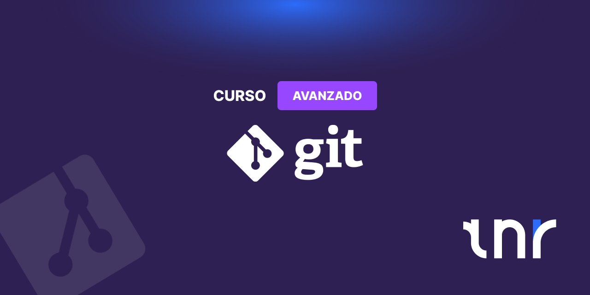

---

# Curso Avanzado de Git

Este curso está diseñado para desarrolladores con experiencia en Git que desean dominar técnicas avanzadas, optimizar flujos de trabajo complejos y aprovechar al máximo las herramientas de GitHub, incluyendo CI/CD, análisis de código, monorepos y buenas prácticas de commits.

---

## Módulo 1: Git Avanzado y Entorno Profesional en GitHub

**Objetivo:** Dominar la configuración avanzada, la seguridad y las buenas prácticas de commits.

**Temas:**

- Configuración avanzada de Git y aliases.
- Gestión de credenciales y seguridad (SSH, tokens).
- Internals de Git: objetos, DAG, stash y reflog.

**Ejercicios sugeridos:**

- Crear aliases útiles
- Explorar reflog y stash con ejemplos prácticos.

---

## Módulo 2: Branching y Workflows

**Objetivo:** Reforzar lo básico de ramas y workflows, con enfoque en buenas prácticas y colaboración en GitHub.

**Temas:**

- Git Flow, GitHub Flow y Trunk Based Development (resumen rápido).
- Naming conventions y ramas protegidas en GitHub.
- **Conventional Commits:** estándar de commits y ventajas.
- Pull Requests: revisión, estrategias de merge (squash, rebase, merge commit) y prevención de conflictos.
- Integración con GitHub Projects: issues, milestones, tableros y automatizaciones.

**Ejercicios sugeridos:**

- Crear un flujo de trabajo con ramas protegidas y PRs en un proyecto de ejemplo.
- Configurar tableros de GitHub Projects y vincular issues a PRs.
- Simular conflictos y practicar merges con squash y rebase.

---

## Módulo 3: Resolución de conflictos y depuración avanzada

**Objetivo:** Dominar técnicas de recuperación, análisis y resolución de conflictos complejos.

**Temas:**

- **Reflog:** recuperación de commits y ramas borradas.
- **Git Bisect:** localizar commits problemáticos e integración con tests automáticos.
- **Blame y log avanzado:** análisis de autores y cambios históricos.
- Resolución de conflictos en PRs: uso de editores online vs locales.

**Ejercicios sugeridos:**

- Recuperar un commit perdido usando reflog.
- Localizar un bug usando git bisect en un proyecto con tests.
- Analizar cambios históricos con git blame y log avanzado.
- Resolver conflictos complejos en PRs de ejemplo.

---

## Módulo 4: Integración Continua y Análisis Automático con GitHub Actions

**Objetivo:** Automatizar validaciones, análisis de calidad de código y despliegues.

**Temas:**

- **Commitlint:** validación automática de commits, integración con hooks y workflows.
- **Husky y hooks locales:** pre-commit, pre-push, integración con linters y tests automáticos.
- Workflows, jobs y runners en GitHub Actions.
- Automatización de tests, linting y builds.
- Validación de pull requests y checks obligatorios.
- Integración de Commitlint y Conventional Commits en CI/CD.
- **Análisis de calidad y seguridad:**
  - SonarQube: calidad de código, cobertura y detección de bugs.
  - Snyk: análisis de vulnerabilidades en dependencias y contenedores.

**Ejercicios sugeridos:**

- Crear un workflow que ejecute tests y linting en cada push y PR.
- Integrar Commitlint en CI para validar commits automáticamente.
- Configurar SonarQube y Snyk en un proyecto de ejemplo y analizar resultados.

---

## Módulo 5: Optimización, Versionado y Gestión Avanzada en GitHub

**Objetivo:** Gestionar repositorios grandes, monorepos y releases de forma profesional.

**Temas:**

- Submódulos y subtrees: diferencias, ventajas y desventajas.
- **Monorepos:** concepto, ventajas, retos y estrategias en GitHub.
- Optimización de repositorios grandes (sparse-checkout, partial clones, compresión).
- Seguridad y auditoría: protección de ramas, control de force push, firmas GPG.
- **Versionado SemVer y tags en Git/GitHub:**
  - SemVer (major.minor.patch) y convenciones.
  - Uso de tags para releases y despliegues automáticos.
  - Integración con GitHub Actions para generar releases.
- Proyectos colaborativos avanzados: automatización de issues, milestones y GitHub Projects.

**Ejercicios sugeridos:**

- Configurar un repositorio monorepo con submódulos o subtrees.
- Crear releases con tags SemVer y firmarlas.
- Optimizar un repositorio grande y aplicar buenas prácticas de seguridad.
- Automatizar milestones y issues en GitHub Projects.

---
